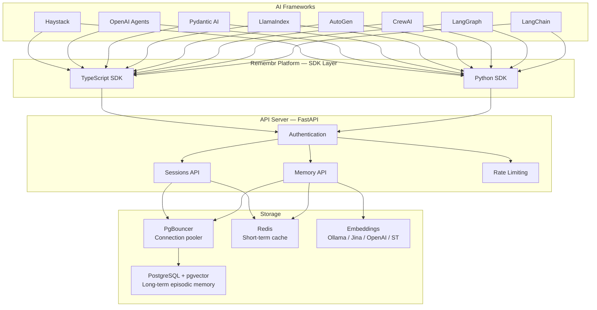

# Remembr

> AI agents are stateless by default — they forget everything between 
> sessions. Remembr gives them persistent, searchable memory that 
> survives restarts, scales across users, and integrates with every 
> major AI framework in under 10 lines of code.

[](LICENSE)
[](https://python.org)
[](https://typescriptlang.org)

---

## The Problem

Stateless agents create broken user experiences at scale:

- **Users repeat themselves** — every new session starts from zero
- **Agents lose context** — no memory of past decisions, preferences, 
  or conversations
- **No multi-tenant isolation** — shared memory across users is a 
  security and compliance risk
- **No GDPR compliance** — no way to erase a specific user's data 
  on demand

Remembr solves all four with a single self-hostable service.

---

## 🏗️ Architecture


**How it works:**
- AI frameworks connect via native adapters (Python or TypeScript SDK)
- All requests pass through JWT authentication and rate limiting
- Memory API handles semantic storage and hybrid search via 
  pgvector + pluggable embeddings (Ollama by default, no API key needed)
- Sessions API manages conversation windows and context scoping
- PostgreSQL stores long-term episodic memory with vector similarity 
  search; Redis caches short-term conversation windows

---

## ⚡ Performance

| Operation | Latency | Notes |
|-----------|---------|-------|
| Memory store | ~25ms | Single memory write |
| Semantic search | ~80ms | Top-5 results, hybrid mode |
| Session create | ~15ms | New session initialization |
| Batch store (10) | ~120ms | Batched embedding request |

*Measured on a single-instance Docker deployment, 
Jina embeddings v3, PostgreSQL with pgvector index.*

---

## 🚀 Quick Start
```bash
# 1. Clone
git clone https://github.com/emartai/remembr.git
cd remembr

# 2. Configure environment
cp .env.example .env
# Set JINA_API_KEY and generate SECRET_KEY:
# python -c "import secrets; print(secrets.token_hex(32))"

# 3. Start services
docker-compose up -d

# 4. Run migrations
docker-compose exec server alembic upgrade head

# 5. Verify
curl http://localhost:8000/health
```

See [QUICKSTART.md](QUICKSTART.md) for full walkthrough including 
user registration and API key setup.

---

## 📦 Install the SDK
```bash
# Python
pip install remembr

# TypeScript
npm install @remembr/sdk
```

---

## 💻 Usage

### Python
```python
import asyncio
from remembr import RemembrClient

async def main():
    client = RemembrClient(
        api_key="your-api-key",
        base_url="http://localhost:8000/api/v1"
    )

    # Create a session
    session = await client.create_session(
        metadata={"user": "demo", "context": "support"}
    )

    # Store a memory
    await client.store(
        content="User prefers email notifications on Fridays",
        role="user",
        session_id=session.session_id,
        tags=["preference", "notification"]
    )

    # Search memories (hybrid = vector + keyword)
    results = await client.search(
        query="When should I send notifications?",
        session_id=session.session_id,
        limit=5,
        mode="hybrid"
    )

    for memory in results.results:
        print(f"[{memory.role}] {memory.content} (score: {memory.score:.3f})")

    await client.aclose()

asyncio.run(main())
```

### TypeScript
```typescript
import { RemembrClient } from '@remembr/sdk';

const client = new RemembrClient({
    apiKey: process.env.REMEMBR_API_KEY!,
    baseUrl: 'http://localhost:8000/api/v1'
});

const session = await client.createSession({
    metadata: { user: 'demo', context: 'support' }
});

await client.store({
    content: 'User prefers dark mode interface',
    role: 'user',
    sessionId: session.session_id,
    tags: ['preference', 'ui']
});

const results = await client.search({
    query: 'What are the user UI preferences?',
    sessionId: session.session_id,
    limit: 5,
    mode: 'hybrid'
});
```

---

## 🔌 Framework Adapters

Native adapters for 8 major AI frameworks — all production-ready 
and fully tested.

| Framework | Adapter | Status |
|-----------|---------|--------|
| LangChain | `adapters.langchain` | ✅ Tested |
| LangGraph | `adapters.langgraph` | ✅ Tested |
| CrewAI | `adapters.crewai` | ✅ Tested |
| AutoGen | `adapters.autogen` | ✅ Tested |
| LlamaIndex | `adapters.llamaindex` | ✅ Tested |
| Pydantic AI | `adapters.pydantic_ai` | ✅ Tested |
| OpenAI Agents | `adapters.openai_agents` | ✅ Tested |
| Haystack | `adapters.haystack` | ✅ Tested |

---

## 📌 Key Engineering Decisions

**Why PostgreSQL + pgvector over a dedicated vector DB?**
Dedicated vector DBs (Pinecone, Weaviate) add operational complexity 
and cost. pgvector gives 90% of the performance inside the same 
database that stores relational data — reducing infrastructure to 
a single service. Swap to a dedicated vector DB when you exceed 
10M+ vectors.

**Why Redis for short-term memory instead of PostgreSQL?**
Conversation windows need sub-millisecond reads and frequent 
rewrites. PostgreSQL is optimized for durability, not ephemeral 
cache patterns. Redis handles this at ~1ms latency while PostgreSQL 
handles persistent long-term storage — each tool doing what it 
does best.

**Why Jina AI for embeddings?**
Jina's asymmetric embeddings model separate query and passage 
representations — critical for memory retrieval where the search 
query ("what did the user say about notifications?") has a 
different semantic structure than the stored memory 
("user prefers email on Fridays"). This improves retrieval 
precision over symmetric embedding models.

**Why multi-tenant row-level security at the DB layer?**
Application-level filtering can be bypassed by bugs. RLS enforces 
isolation at the PostgreSQL level — a query from org A 
physically cannot return rows from org B, regardless of 
application code.

---

## 🛠️ Self-Hosting

### Docker Compose (Recommended)
```bash
git clone https://github.com/emartai/remembr.git
cd remembr
cp .env.example .env
# Edit .env with JINA_API_KEY and SECRET_KEY
docker-compose up -d
docker-compose exec server alembic upgrade head
```

### Environment Variables

| Variable | Description | Required |
|----------|-------------|----------|
| `DATABASE_URL` | PostgreSQL connection (asyncpg) | ✅ |
| `REDIS_URL` | Redis connection string | ✅ |
| `JINA_API_KEY` | Jina AI API key for embeddings | ✅ |
| `SECRET_KEY` | JWT signing secret (hex string) | ✅ |
| `ENVIRONMENT` | Runtime environment | No |
| `LOG_LEVEL` | Logging level (default: INFO) | No |
| `EMBEDDING_BATCH_SIZE` | Batch size for embedding requests | No |
| `RATE_LIMIT_SEARCH_PER_MINUTE` | Search rate limit | No |

See `.env.example` for the full variable reference.

---

## 📁 Repository Structure
```
remembr/
├── adapters/              # Framework adapters (8 frameworks)
│   ├── langchain/
│   ├── langgraph/
│   ├── crewai/
│   ├── autogen/
│   ├── llamaindex/
│   ├── pydantic_ai/
│   ├── openai_agents/
│   └── haystack/
├── server/                # FastAPI server
│   ├── app/
│   │   ├── api/           # REST endpoints
│   │   ├── db/            # Database models & migrations
│   │   ├── services/      # Business logic
│   │   ├── repositories/  # Data access layer
│   │   └── middleware/    # Auth, rate limiting
│   └── alembic/           # Database migrations
├── sdk/
│   ├── python/            # Python SDK (PyPI: remembr)
│   └── typescript/        # TypeScript SDK (npm: @remembr/sdk)
├── tests/                 # End-to-end & integration tests
├── docs/                  # Adapter guides + API reference
├── docker-compose.yml
├── QUICKSTART.md
└── ARCHITECTURE.md
```

---

## 🗺️ Roadmap

- [ ] Memory summarization — auto-compress old memories to stay 
  within context limits
- [ ] Importance scoring — weight memories by recency and 
  access frequency
- [ ] Forgetting curve — decay low-relevance memories over time
- [ ] REST webhooks — notify on memory threshold events
- [ ] Managed cloud option — hosted Remembr with zero infra setup

---

## Contributing

See [CONTRIBUTING.md](CONTRIBUTING.md) for development setup, 
branching strategy, commit conventions, and PR process.

---

## 📄 License

MIT License — Copyright (c) 2026 Emmanuel Nwanguma  
See [LICENSE](LICENSE) for full text.

---

**Built by [Emmanuel Nwanguma](https://linkedin.com/in/nwangumaemmanuel)**  
[LinkedIn](https://linkedin.com/in/nwangumaemmanuel) ·
[GitHub](https://github.com/Emart29) ·
[Email](mailto:nwangumaemmanuel29@gmail.com)
