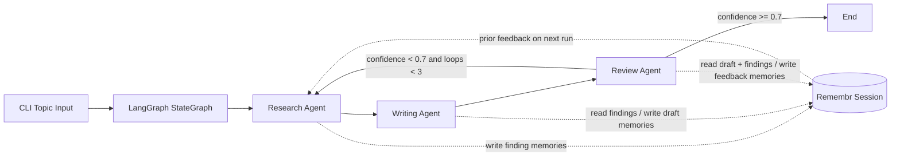

# LangGraph Multi-Agent Memory Loop

This example shows how to keep a three-agent workflow coherent without stuffing every prior artifact back into the prompt on every hop. The research, writing, and review agents share Remembr memory through the LangGraph adapter, so each run can recover the parts it needs from durable memory instead of carrying an ever-growing message history.

## What Problem It Solves

Long-running agent systems usually degrade in one of two ways:

- They keep every artifact in the live prompt, which bloats context windows and makes handoffs noisy.
- They drop earlier work entirely, which makes each run forget prior feedback and repeat the same mistakes.

This example keeps the live LangGraph state small while persisting findings, drafts, and review feedback in Remembr. On the next run for the same topic, the research agent queries prior `kind:feedback` memories and adjusts its research plan before it writes anything new.

## Architecture



ASCII view:

```text
topic -> research -> write -> review -- low confidence --> research
                           \------ high confidence -----> end

All three agents share one Remembr session_id per topic.
```

## First Run Vs Second Run

First run for `why-are-transformer-models-dominant-in-2026`:

- Research gathers findings from the search tool.
- Writing turns those findings into a draft.
- Review stores feedback like “compare transformers against state-space and MoE tradeoffs more explicitly.”

Second run for the same topic:

- The same topic slug resolves to the same `session_id`.
- The research agent runs a `tag_filters=[{key: "kind", value: "feedback"}]` query.
- Its prompt now includes the stored critique, so the next research pass is steered by prior review instead of starting from scratch.

That is the core pattern: feedback lives in Remembr and becomes retrieval context, not prompt bloat.

## Files

- `src/graph.py`: LangGraph state machine and loop condition.
- `src/memory.py`: thin Remembr + LangGraph adapter wrapper shared by all agents.
- `src/agents/research.py`: research node plus a web search tool.
- `src/agents/writing.py`: draft generation node.
- `src/agents/review.py`: review node that stores feedback memories.
- `src/topics.py`: sample topics and topic slug helper.
- `src/run.py`: CLI entrypoint.

## Setup

1. Start the platform at the repo root:

```bash
docker-compose up
```

2. In another shell, install the example:

```bash
cd examples/langgraph-multi-agent
cp .env.example .env
pip install -e .
```

3. Run the graph:

```bash
python -m src.run "Why are transformer models dominant in 2026?"
```

## What To Expect

- The runner prints the topic, session ID, loop count, research findings, the latest draft, and the final review payload.
- The first run creates a new session mapping for the topic slug.
- Re-running the same topic reuses that session and surfaces past review feedback in the research prompt.
- If review confidence stays below `0.7`, the graph loops back to research up to three times.

## Environment

Copy `.env.example` to `.env` and set:

- `REMEMBR_API_KEY`
- `REMEMBR_BASE_URL`
- `OPENAI_API_KEY`
- optionally `OPENAI_MODEL`

## Run The Tests

```bash
cd examples/langgraph-multi-agent
pytest
```

## Limitations

- This does not fine-tune models; it is retrieval plus orchestration.
- This does not replace evals or human review; it gives agents a durable memory surface.
- The bundled web-search tool uses DuckDuckGo’s public instant-answer endpoint, which is lightweight and imperfect.
- This is a reference architecture meant to be forked, specialized, and hardened for your own workloads.
